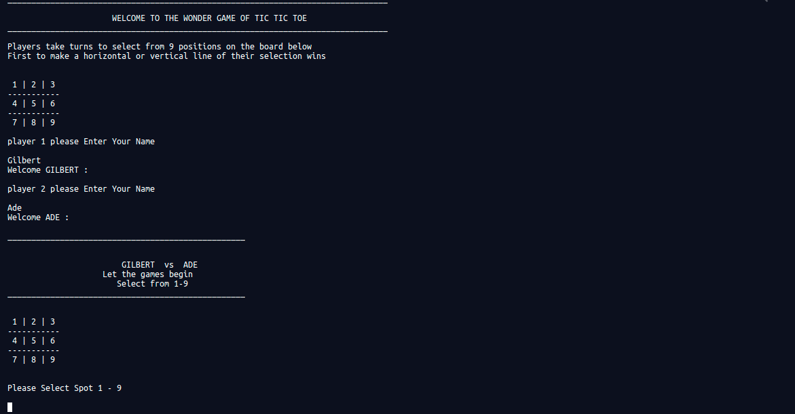

# tic_tac_toe
Build a tic-tac-toe game on the command line where two human players can play against each other and the board is displayed in between turns.

## Project screenshot

#### Game Instructions
Tic-Tac-Toe is a very popular game, which consists in making a sequence of three symbols in either a row, column or diagonal in a 3x3 board.

To play the game follow the game installation steps mention below this file. After you've done that, run the main file and follow these steps:

1. Enter the first player's name;
2. Welcomes first player;
3. Enter the second player's name;
4. Welcomes the second player;
5. The game will begin. The Tic-Tac-Toe board will be printed and it will show numbers from 1 to 9;
6. To win this game one player must make a sequence of three tokens either on lines, columns or diagonals;
7. Choose the position where you want to place your first token, it must be between 1 to 9;
8. After that, this position will be taken and the second player will take this turn;
9. The selected position can't be chosen twice else it displays position taken;
10. The game will take turns until a player wins or no more positions are available on the board, in this case it will   be a draw!
11. As soon as the game ends it ask players if they would like to play again, if yes it continues if no it stops.

## 🔨 Built in

- Ruby
- Rubocop
- Stickler-CI

## 🚀 Our Project

Our project can be found at https://repl.it/@GilbertGotora/tictactoe
## Live Demo

[Live Demo Link](https://repl.it/@GilbertGotora/tictactoe

## To run the project in local

- clone the repository from here [repo link](https://github.com/Adewunmi97/tic_tac_toe.git)

- Enter to GIT bash and hit: https://github.com/Adewunmi97/tic_tac_toe.git

- Run ruby bin/main.rb on your terminal

## 👨🏽‍💻 👨🏿‍💻 Creators

👤 **Author1**

- Github: [@Adewunmi97](https://github.com/Adewunmi97)

👤 **Author2**

- Github: [@ggotora](https://github.com/ggotora)

## 🤝 Contributing

Contributions, issues and feature requests are welcome!

Feel free to check the [issues page](issues/).

## Show your support

Give a ⭐️ if you like this project!

## 📝 License

This project is [MIT](lic.url) licensed.
